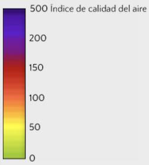

```{r echo=TRUE, warning=FALSE, error=FALSE, message=FALSE}
library(readr)
library(ggplot2)
library(stringr)
library(dplyr)
library(knitr)
library(tidyr) 
library(class)
library(rpart)
library(lubridate)
library(randomForest)
set.seed(137926)
pollution_complete <- read_csv("pollution.csv")
row.has.na <- apply(pollution_complete, 1, function(x){any(is.na(x))})
pollution <- pollution_complete[!row.has.na,]
numero_NA <- dim(pollution_complete)[1] -dim(pollution)[1]

pollution<- pollution[order( pollution$year, pollution$month,pollution$day),]
totales<- dim(pollution)[1]

#queremos saber que variables son categoricas y cuales numericas
classes <- sapply(pollution, function(x) class(x))
categoric_cols <- pollution[,which(classes %in% c("character", "factor"))]
numeric_cols <- pollution[, -which(classes %in% c("character", "factor"))]

#cuantos valores unicos --cardinalidad
uniques_num <- sapply(numeric_cols, function(x) unique(x) %>% length())
uniques_num <- as.data.frame(uniques_num)

uniques_cat <- sapply(categoric_cols, function(x) unique(x) %>% length())
uniques_cat <- as.data.frame(uniques_cat)

#valores unicos
uniques_values_num <- sapply(numeric_cols, function(x) unique(x))
uniques_values_cat <- sapply(categoric_cols, function(x) unique(x))

#proporcion valores unicos - uniqueness
uniqueness_num <-  round(uniques_num/totales * 100, 2)
uniqueness_num <- as.data.frame(uniqueness_num)

uniqueness_cat <-  round(uniques_cat/totales * 100, 2)
uniqueness_cat <- as.data.frame(uniqueness_cat)
                                
#checamos si hay vacios 
nan_num <- sapply(numeric_cols, function(x) sum(is.na(x)))
nan_num <- as.data.frame(nan_num)

nan_cat <- sapply(categoric_cols, function(x) sum(is.na(x)))
nan_cat <- as.data.frame(nan_cat)

#para sacar la moda, redondeamos a 2 digitos
my_mode <- function(x){
  if (class(x) %in% c("character", "factor")) {
    table(x) %>%
      which.max() %>%
      names()
  }
  else {
    table(round(x, 2)) %>%
      which.max() %>%
      names()
  }
}


#moda
modes_num <- sapply(numeric_cols, function(x) my_mode(x))
modes_num <- as.data.frame(modes_num)

modes_cat <- sapply(categoric_cols, function(x) my_mode(x))
modes_cat <- as.data.frame(modes_cat)


#min 
mins <- sapply(numeric_cols, function(x) min(x))
mins <- as.data.frame(mins)

#max
maxs <- sapply(numeric_cols, function(x) max(x))
maxs <- as.data.frame(maxs)

#mean
means <- sapply(numeric_cols, function(x) mean(x))
means <- as.data.frame(means)

#median
medians <- sapply(numeric_cols, function(x) median(x))
medians <- as.data.frame(medians)

#1st quantile
first_qtls <- sapply(numeric_cols, function(x) quantile(x)[2]) #revisa la funcion quantile!
first_qtls <- as.data.frame(first_qtls)

#3rd quantile
third_qtls <- sapply(numeric_cols, function(x) quantile(x)[4]) 
third_qtls <- as.data.frame(third_qtls)

#sd
sds <- sapply(numeric_cols, function(x) sd(x))
sds <- as.data.frame(sds)

###generamos nuestra tabla de data profiling
df_categoric <- cbind(uniques_cat, uniqueness_cat, nan_cat, modes_cat)
#no me gusta que tengan en la columna cat... 
names(df_categoric) <- str_replace_all(names(df_categoric), "_cat", "")
names(df_categoric)[2]<-"uniqueness"

df_numeric <- cbind(uniques_num, uniqueness_num, nan_num, mins, maxs, means,
                    sds, medians, modes_num, first_qtls, third_qtls) 
names(df_numeric) <- str_replace_all(names(df_numeric), "_num", "")
names(df_numeric)[2]<-"uniqueness"
```


## Introducción al problema


Una investigación del Colegio del Medio Ambiente de la Universidad de Nanjing relacionó la contaminación con casi un tercio de todas las muertes que se producen en China, ubicando a la polución en el mismo nivel que fumar tabaco como amenaza para la salud pública. El estudio analiza casi 3 millones de muertes en 74 ciudades chinas durante 2013. Los hallazgos revelan que un 31,8% de todas las muertes registradas podrían estar relacionadas con la contaminación, con las grandes de ciudades de Hebei, la provincia que rodea a Beijing, clasificadas entre las peores.[Extraído de CNN](http://cnnespanol.cnn.com/2017/01/17/la-contaminacion-en-beijing-la-ciudad-donde-ricos-y-pobres-no-respiran-el-mismo-aire/).

Debido a los grandes problemas que ha causado la contaminación en China y la gran importancia en la salud que tiene, nosotros buscaremos analizar y predecir los niveles de contaminación en la ciudad de Beijing usando métodos de regresión. A lo largo de este trabajo estaremos trabajando con una base de datos que contiene información relacionada a la contaminación de Beijing del 1 de enero de 2010 al 31 de diciembre del 2014, y buscaremos ver que tan bien podemos predecir los niveles de contaminación del año 2014, a partir de los años 2010, 2011, 2012 y 2013.

En la siguiente imagen podemos observar la calidad del aire segun el PM2.5:

<div style="text-align:center" markdown="1">

</div>

Nuestra base de datos contiene **`r dim(pollution_complete)[1]`** registros, sin embargo, haciendo un pequeño análisis, vemos que contiene **`r numero_NA`** registros con información faltante. Como nuestro modelo es de regresión nosotros eliminaremos esos registros, para solo trabajar con información consistente. Además, nuestra base de datos contiene las siguientes columnas:

```{r echo=TRUE, warning=FALSE, message=FALSE, error=FALSE}
colnames(pollution)
```

Donde:
+ **No:** Número de Registro
+ **year:** Año en el que se hizo el registro
+ **month:** Mes en el que se hizo el registro
+ **day:** Día en el que se hizo el registro
+ **hour:** Hora en el que se hizo el registro
+ **pm2.5:** Concentración de PM2.5 
+ **DEWP:** Punto de rocío
+ **TEMP:** Temperatura
+ ** PRES: ** Presión
+ **cbwd:** Dirección del aire combinada
+ **iws:** Velocidad del aire acumulada
+ **Is:** Horas acumuladas de nieve
+ **Ir:** Horas acumuladas de lluvia

***
## Data Profiling

Hagamos un analisis de las variables categóricas:

```{r echo=T, warning=F, error=F, message=F}
kable(df_categoric, format.args = list(big.mark=",", scientific=F))
```
La única variable categórica que tenemos es 'cbwd' que nos muestra practicamente la dirección del aire. Sin embargo no nos proporciona mucha información relevante, más que la dirección del viento mas predominante es 'SouthEast'

A continuacion analicemos las variables numericas:


```{r echo=T, warning=F, error=F, message=F}
kable(df_numeric, format.args = list(big.mark=",", scientific=F))
```

Es importante mencionar que la variable 'No' no da información importante respecto a lo que buscamos predecir, es por ello que no sera contemplada para el analisis de regresión. Al observar la variable año, podemos observar que hay un equilibrio en cuanto al numero de registros y el año, es decir que se tiene una cantidad bastante similar de registros de cada año. Cabe mencionar que la variable año, dia y mes serán variables bastante importantes en nuestro analisis ya que es muy factible que la fecha del año sea muy influente en cuanto a los niveles de contaminación. Es importante mencionar que las variables que también están muy relacionadas con la contaminación son la de temperatura, presión y el punto de rocio. Al observar que el promedio de PM2.5 es de 98, podemos confirmar quela calidad del aire de Beijing es mala, ya que lo pasable es no ser mayor a un PM2.5 de 50. 
***

##EDA

```{r echo=FALSE, warning=FALSE, error=FALSE, message=FALSE}
ggplot(pollution,aes(x = pm2.5, y =year ))+geom_point()+ggtitle("PM2.5 vs Año")
```

En esta gráfica se puede notar que las observaciones de año vs PM2.5 no tienen mucha relación ya que se tienen todo tipo de muestras y no se puede ver que haya tendencia.
```{r echo=FALSE, warning=FALSE, error=FALSE, message=FALSE}
ggplot(pollution,aes(x = pm2.5, y =month ))+geom_point()+ggtitle("PM2.5 vs Mes")
```

Aquí se puede notar un que existe una mayor relación entre Mes y PM2.5 que entre la variable objetivo y el año pero aún así se ve que no es muy fuerte la relación de estos datos.
```{r echo=FALSE, warning=FALSE, error=FALSE, message=FALSE}
ggplot(pollution,aes(x = pm2.5, y =day ))+geom_point()+ggtitle("PM2.5 vs Día")
```

La variable de Día tampoco tiene una gran relación con la variable que estamos analizando, pero aún así se ve que puede proporcionar información sobre pm2.5
```{r echo=FALSE, warning=FALSE, error=FALSE, message=FALSE}
ggplot(pollution,aes(x = pm2.5, y =hour ))+geom_point()+ggtitle("PM2.5 vs Hora")
```

El caso de la variable Hora es el mismo que las anteriores y es que como son variables discretas pueden llegar a presentar baja relación con la variable objetivo porque esta es de tipo continua. 
```{r echo=FALSE, warning=FALSE, error=FALSE, message=FALSE}
ggplot(pollution,aes(x = pm2.5, y =DEWP ))+geom_point()+ggtitle("PM2.5 vs DEWP")
```

La variable DEWP tiene una relación con PM2.5 más alta que las anteriores y esto se puede ver porque entre más alto es el valor de PM2.5, los valores de DEWP se van acercando a un valor en específico cercano a -10 
```{r echo=FALSE, warning=FALSE, error=FALSE, message=FALSE}
ggplot(pollution,aes(x = pm2.5, y =TEMP ))+geom_point()+ggtitle("PM2.5 vs TEMP")
```

Se puede ver que la Temperatura también tiene relación negativa con PM2.5 pero no es muy grande y es por eso que la línea que puede representar esta relación tiene una pendiente muy alta.
```{r echo=FALSE, warning=FALSE, error=FALSE, message=FALSE}
ggplot(pollution,aes(x = pm2.5, y =PRES ))+geom_point()+ggtitle("PM2.5 vs PRES")
```

La presión parece tener una baja relación con la variable que estamos estudiando pero se puede afirmar que esta relación es positiva. Es importante señalar que también es un poco difícil de ver esta relación debido a que la variable de presión es discreta.
```{r echo=FALSE, warning=FALSE, error=FALSE, message=FALSE}
ggplot(pollution,aes(x = pm2.5, y =Iws ))+geom_point()+ggtitle("PM2.5 vs Isw")
```

El caso de la relación de Isw con la variable PM2.5 es muy curioso porque se ve claramente que existe buena relación entre estas dos aunque no es de tipo lineal, pero también se puede ver muy fácil que si se hiciera una transformación de la variable Isw y se sacara nuevamente la gráfica se puede presentar una mejor relación.
```{r echo=FALSE, warning=FALSE, error=FALSE, message=FALSE}
ggplot(pollution,aes(x = pm2.5, y =Is ))+geom_point()+ggtitle("PM2.5 vs Is")
```

```{r echo=FALSE, warning=FALSE, error=FALSE, message=FALSE}
ggplot(pollution,aes(x = pm2.5, y =Ir ))+geom_point()+ggtitle("PM2.5 vs Ir")
```

Las variables Is e Ir presentan el mismo problema, la relación de cada una de ellas con PM2.5 es muy baja pero se podría incrementar si se descartan las observaciones de 0 en las dos variables y es que estas observaciones son las que hacen que presente baja relación.

```{r echo=TRUE, warning=FALSE, error=FALSE, message=FALSE}
corr_pol <- pollution[, -10]
corr_pol <- corr_pol[,-1]
cor(corr_pol)
```

Las variables que parecen tener mejor relación lineal con la variable objetivo (PM2.5) son DEWP e Isw ya que se nota una tendencia al graficarlas contra la variable que estamos estudiando. Las demás variables sí tienen relación lineal pero muy pequeña, se realizará la regresión lineal con todas las variables que se tienen para después empezar descartar las variables que menos relación tienen con la variable analizada; las variables que menos relación tienen y que son las candidatas a ser eliminadas de la regresión son: Año e IS.

```{r echo=TRUE, warning=FALSE, error=FALSE, message=FALSE}
out_year <- boxplot(pollution$year, plot=F)
out_month <- boxplot(pollution$month, plot=F)
out_day <- boxplot(pollution$day, plot=F)
out_hour <- boxplot(pollution$hour, plot=F)
out_DEWP <- boxplot(pollution$DEWP, plot=F)
out_TEMP <- boxplot(pollution$TEMP, plot=F)
out_PRES <- boxplot(pollution$PRES, plot=F)
out_Iws <- boxplot(pollution$Iws, plot=F)
out_Is <- boxplot(pollution$Is, plot=F)
out_Ir <- boxplot(pollution$Ir, plot=F)
```


El número de outliers de cada variable son:

  + year: **`r length(out_year$out)`**
  + month: **`r length(out_month$out)`** 
  + day: **`r length(out_day$out)`**
  + hour: **`r length(out_hour$out)`**
  + DEWP: **`r length(out_DEWP$out)`**
  + TEMP: **`r length(out_TEMP$out)`**
  + PRES: **`r length(out_PRES$out)`**
  + Iws: **`r length(out_Iws$out)`**
  + Is: **`r length(out_Is$out)`**
  + Ir: **`r length(out_Ir$out)`**


Después sacar la cantidad de datos atípicos de cada variable se puede ver que solo las variables Isw, Is e Ir los presentan. Se debe considerar eliminar los datos atípicos de Iws porque es una de las variables que mayor relación tiene con la variable que estamos analizando; los datos atípicos de las demás variables no son necesarios de eliminar porque son variables que no proporcionarán tanta información a la regresión lineal.

***
## Desarrollo de los modelos
```{r echo=TRUE, warning=FALSE, error=FALSE, message=FALSE}
pollution$No <- NULL
train_set <- pollution %>% filter( year >= 2010 & year <= 2013)
test_set <- filter(pollution, pollution$year == 2014)

validation_rows <- sample(dim(train_set %>% filter( year == 2013))[1], 
                          size=round(dim(train_set)[1]*0.085,0),
                          replace=F) + dim(train_set %>% filter( year <= 2012))[1]
validation_set <- train_set[validation_rows,]
train_set <- train_set[-validation_rows,]
```
A lo largo de este trabajo estaremos trabajando con distintos conjuntos para entrenar, validar y probar los metodos que usaremos para la regresión. Por ello, el conjunto de entrenamiento serán  los registros que tienen fecha del 2010 al año 2013 y este contiene  **`r nrow(train_set)`** registros. Por el otro lado, nuestro conjunto de validación estara compuesto por el 8.5% de registros que nuestro conjunto de entrenamiento, sin embargo, este solamente estara compuesto por registros del año 2013; este contiene **`r nrow(validation_set)`** registros. Por ultimo, el set de pruebas consistira en los registros del año 2014 que justamente tiene un tamaño de **`r nrow(test_set)`**.


***

###Regresión Lineal

```{r echo=TRUE, warning=FALSE, error=FALSE, message=FALSE}
train_set_reg <- select(train_set, year, month, day, hour,pm2.5, DEWP, TEMP, PRES, Iws, Ir, Is)
validation_set_reg <- select(validation_set, year, month, day, hour,pm2.5, DEWP, TEMP, PRES, Iws, Ir, Is)

regresion <- lm(pm2.5 ~ year + month + day+ hour+ DEWP+ TEMP + PRES + Iws + Ir + Is,  data=train_set_reg)
summary(regresion)
```

Se puede notar que todas la variables proporcionan buena información al modelo de regresión, pero a pesar de esto la R² de esta regresión lineal es muy baja y por esta razón se puede afirmar que esta regresión lineal no es un buen modelo de regresión porque las variables no explican gran parte de la varianza de la variable objetivo.

####Graficando los errores
```{r echo=TRUE, warning=FALSE, error=FALSE, message=FALSE}
fitted_values <- regresion$fitted.values
residuals <- regresion$residuals

residuals_df <- data.frame(fitted_values=fitted_values,
                           residuals=residuals)

ggplot(residuals_df, aes(x=fitted_values,
                         y=residuals)) +
  geom_point() +
  geom_hline(yintercept=0)
```


```{r echo=TRUE, warning=FALSE, error=FALSE, message=FALSE}
ggplot(residuals_df, aes(x=residuals)) +   geom_histogram()
```

Se puede ver que los errores no presentan una distribución normal, su distribución es más parecida a una chi-cuadrada pero esta no es la distribución que buscamos en los errores de una regresión lineal.
```{r echo=TRUE, warning=FALSE, error=FALSE, message=FALSE}
#produce una grafica con el QQ de una normal
qqnorm(residuals_df$residuals, 
       ylab="Residuals", main="")
#se agrega la linea de 
qqline(residuals_df$residuals)
```

Con la gráfica Q-Q de una distribución normal se puede confirmar lo que el histograma mostraba, que los residuos no siguen una distribución normal y es por esto que la regresión lineal utilizada no puede considerarse como un buen modelo para lo que intentamos hacer.
```{r echo=TRUE, warning=FALSE, error=FALSE, message=FALSE}
regresion$coefficients
```


####Transformación de variable Iws

Como se vio al realizar el EDA de los datos, existe una variable que tiene gran relación con la variable que estamos analizando, pero el problema es que no es una relación lineal. Es por esta razón que se puede considerar como una alternativa el transformar esta variable para que la relación que presente con PM2.5 sea lineal y al momento de utilizarla en una regresión lineal se pueda incrementar el valor de R².
La transformación que vamos a utilizar es sacar el logaritmo natural de Iws y ver si la relación con Pm2.5 ya es lineal:

```{r echo=TRUE, warning=FALSE, error=FALSE, message=FALSE}

iws <- pollution [, 10]
for(i in 1:length(iws)){
  iws [i] <- log(iws[i])
}

pollution_transf <- pollution[,-10]
pollution_transf <- cbind2(pollution_transf, iws)
names(pollution_transf)[12]<- "Iws"
names(pollution_transf)

ggplot(pollution_transf,aes(x = pm2.5, y =Iws ))+geom_point()+ggtitle("PM2.5 vs Isw")
```

Después de realizar la tansformación de la variable se puede ver que la relación ya es lineal así que se realizará una nueva regresión pero ya no se utilizará la variable Iws normal, sino la variable que se obtuvo del logaritmo de Iws.

```{r echo=TRUE, warning=FALSE, error=FALSE, message=FALSE}
train_set_transf <-pollution_transf %>% filter( year >= 2010 & year <= 2013)
train_set_reg_tra <- select(train_set_transf, year, month, day, hour,pm2.5, DEWP, TEMP, PRES, Iws, Ir, Is)

regresion_transf <- lm(pm2.5 ~ year + month + day+ hour+ DEWP+ TEMP + PRES + Iws + Ir + Is,  data=train_set_reg_tra)
summary(regresion_transf)
```


####Graficando los errores
```{r echo=TRUE, warning=FALSE, error=FALSE, message=FALSE}
fitted_values <- regresion_transf$fitted.values
residuals <- regresion_transf$residuals

residuals_df <- data.frame(fitted_values=fitted_values,
                           residuals=residuals)

ggplot(residuals_df, aes(x=fitted_values,
                         y=residuals)) +
  geom_point() +
  geom_hline(yintercept=0)
```


```{r echo=TRUE, warning=FALSE, error=FALSE, message=FALSE}
ggplot(residuals_df, aes(x=residuals)) +   geom_histogram()
```

Después de hacer la regresión se puede ver que, al igual que la primera regresión, los residuos obtenidos no cumplen con los supuesto que requiere una regresión lineal. Es decir, no tienen una distribución normal y al graficarlos paracen tener cierta tendencia. Por estas razones se puede decir que los residuos presentan heterocedasticidad.

```{r echo=TRUE, warning=FALSE, error=FALSE, message=FALSE}
#produce una grafica con el QQ de una normal
qqnorm(residuals_df$residuals, 
       ylab="Residuals", main="")
#se agrega la linea de 
qqline(residuals_df$residuals)
```


Al igual que la primera regresión lineal que se realizó, los residuos no siguen una distribución normal y esto se puede ver claramente en la gráfica Q-Q.
```{r echo=TRUE, warning=FALSE, error=FALSE, message=FALSE}
regresion$coefficients
```

***
###Arboles de regresión

No todo conjunto de datos puede ser aproximado por una regresión lineal, ya que el comportamiento del conjunto de datos puede ser no lineal. Debido a ello optaremos por usar regresión utilizando arboles, que como sabemos es una alternativa para modelos no lineales. A continuacion realizaremos nuestra regresión a partir de un minimo de 5 observaciones por hoja; a continuación veamos graficas de R^2 y de los errores relativos de acuerdo al numero de splits del algoritmo
```{r echo=TRUE, warning=FALSE, error=FALSE, message=FALSE}
reg_tree <- rpart(train_set$pm2.5 ~., data=train_set, 
                  control=list(minsplit=5),
                  method="anova")
summary(reg_tree)
rsq.rpart(reg_tree)

```

Como podemos observar en las gráficas anteriores la regresión por este método no es demasiado buena, ya que por ejemplo, tenemos un valor de **R^2** bastante bajo de aproximadamente de alrededor de .3 y errores relativos bastante altos. A pesar de lo anterior, para proseguir con este método usaremos 7 splits y por tanto un CP de .014697. Lo anterior es debido a que vemos que apartir de 7 splits, el error relativo y el R^2 ya no cambian demasiado.

A continuación lo que haremos será podar nuestro arbol de acuerdo al CP que escogimos, y aplicaremos la regresión sobre nuestro set de validación. Ahora veamos una grafica de los residuales:
```{r echo=TRUE, warning=FALSE, error=FALSE, message=FALSE}
pruned_tree <- prune(reg_tree, cp=.014697)
pruned_tree_predictions_val <- predict(pruned_tree, validation_set)
residuals_pruned_tree_val <- validation_set$pm2.5 - pruned_tree_predictions_val
df_2_val <- data.frame(fitted_values=pruned_tree_predictions_val,
                 residuals=residuals_pruned_tree_val)


ggplot(df_2_val, aes(x=fitted_values, y=residuals)) +
  geom_point() +
  geom_hline(yintercept = 0, color="red") +
  theme_bw()
MSE <- sum(residuals_pruned_tree_val^2)
R2 <- 1 - sum((validation_set$pm2.5-pruned_tree_predictions_val)^2)/sum((validation_set$pm2.5-mean(validation_set$pm2.5))^2)

```

Como podemos observar de la gráfica anterior tenemos residuales bastantes altos! Ya que vemos que hay una concentración.
###Random Forest
```{r echo=TRUE, warning=FALSE, error=FALSE, message=FALSE}
train_rf <-train_set
train_rf$cbwd <- NULL
rf_reg <- randomForest(pm2.5 ~., data=train_rf, 
                       ntree=200,
                       nodesize=7,
                       importance=T)
varImpPlot(rf_reg)
```
```{r echo=TRUE, warning=FALSE, error=FALSE, message=FALSE}
fitted_values_rf1_val <- predict(rf_reg, 
                         newdata=validation_set,
                         type="response")

residuals_rf1_val <- validation_set$pm2.5 - fitted_values_rf1_val


df_rf1_performance_val <- data.frame(fitted_values=fitted_values_rf1_val,
                                residuals=residuals_rf1_val)

df_rf1_performance_val[which(is.na(df_rf1_performance_val$fitted_values)), 
                  "fitted_values"] <- 0

ggplot(df_rf1_performance_val, aes(x=fitted_values, y=residuals)) +
  geom_point() +
  geom_hline(yintercept = 0, color="red") +
  theme_bw()
MSE <- sum(residuals_rf1_val^2)
MSE


y <- validation_set$pm2.5
1 - sum((y-fitted_values_rf1_val)^2)/sum((y-mean(y))^2)
cor(fitted_values_rf1_val, y)^2
```
